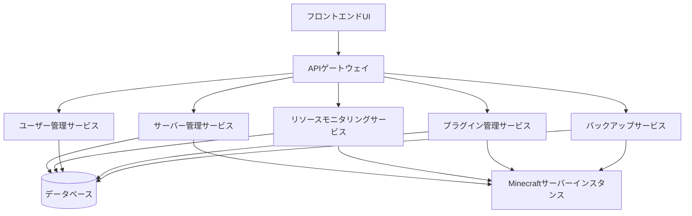

# システムパターン

## アーキテクチャ概要
このプロジェクトはマイクロサービスアーキテクチャを採用し、各機能を独立したサービスとして実装しています。コンテナ技術を活用して、移植性と拡張性を確保しています。

## 設計原則
- **マイクロサービス**: 独立したサービスで機能を分離
- **コンテナベース**: Dockerを使用した一貫した環境
- **APIファースト**: すべての機能はAPIを通じて利用可能
- **疎結合**: サービス間の依存関係を最小化
- **可観測性**: 包括的なロギングとモニタリング

## 主要コンポーネント

### フロントエンドUI
- Web基盤のダッシュボード
- React/Next.jsで実装
- レスポンシブデザイン

### バックエンドサービス
1. **サーバー管理サービス**
   - サーバーの作成、設定、起動、停止
   - 設定ファイルの管理

2. **リソースモニタリングサービス**
   - CPU、メモリ、ディスク使用量の監視
   - パフォーマンス最適化推奨

3. **ユーザー管理サービス**
   - 管理者アカウント管理
   - 権限制御

4. **プラグイン管理サービス**
   - プラグインのインストール、更新、削除
   - 互換性チェック

5. **バックアップサービス**
   - 自動バックアップスケジューリング
   - データ復元

## データフロー
- RESTful APIを通じたサービス間通信
- イベント駆動型アーキテクチャの部分的採用
- データベースはPostgreSQLを使用

## セキュリティパターン
- JWT認証
- APIゲートウェイでのリクエスト検証
- ロールベースのアクセス制御
- データ暗号化
- 定期的なセキュリティ監査 